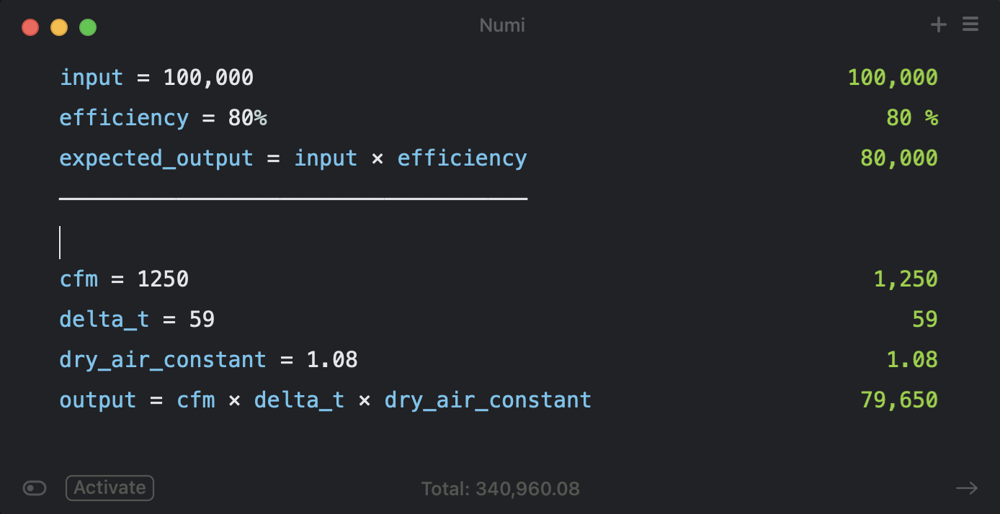
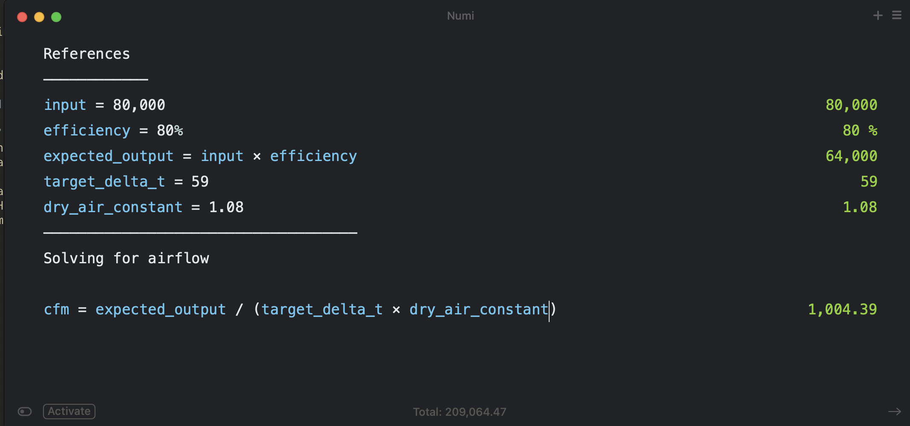

# Why Input is Needed to Use Sensible Heat Formula

Without confirming input of an appliance the sensible heat formula does not
give you the appropriate output.

Let's look into what's required for the sensible heat formula.

Output = CFM x Delta-T x 1.08

## Thought Experiment

For this thought experiment, we'll ignore the fact that 1.08 is not the
appropriate number all the time.

Here are the inputs and expected results.

Now, let us say we don't know the input / can't clock the gas meter or we were
not the ones who set the equipment up. We're trying to prove the output to the
customer based on the above sensible heat formula.

So let's say that the actual input to the appliance is 80,000 BTU/H instead of
the rated 100,000 BTU/H when the equipment was commissioned.  The installer sets
the unit up for the temperature rise specified on the data plate because they
don't know any better or there's not a feasible way to clock the gas meter.

Sure an super experienced / detailed tech may realize that 1,000 CFM instead of
of the 1,250 CFM is off for the given input of the appliance.  However in the
grand scheme of things these numbers aren't _that_ far off from each other, so
it is possible that we're chasing our tail trying to solve (or prove the output)
when all the numbers seem reasonable.

## Conclusion

So is input needed to use the sensible heat formula? Technically no, however
hopefully this thought experiment shows the importance or pitfalls of not
having / considering the *actual* input to the appliance.

